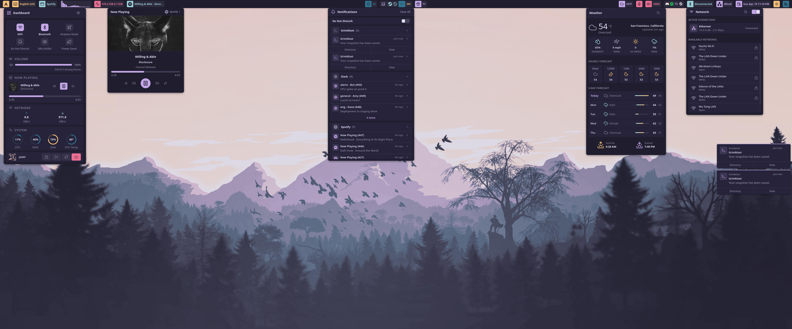
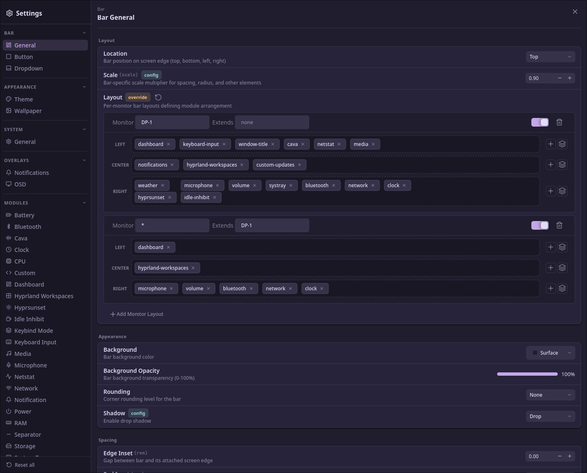

<p align="center">
  
</p>

# Wayle

<p align="center">
  <a href="https://github.com/wayle-rs/wayle/actions"></a>
  <a href="https://github.com/wayle-rs/wayle/blob/master/LICENSE"></a>
  <a href="https://wayle.app"></a>
</p>

A Wayland desktop shell with the bar, notifications, OSD, wallpaper, and device controls built in. Written in Rust with GTK4 and Relm4.

Configure it in `config.toml`, through the `wayle-settings` GUI, or with the `wayle config` CLI.

<p align="center">
  
</p>

<p align="center">
  
</p>

## Documentation

Full guides, reference, and walkthroughs are at **[wayle.app](https://wayle.app)**.

- [Getting started](https://wayle.app/guide/getting-started) - Installation instructions
- [Editing config](https://wayle.app/guide/editing-config) - File layout, live reload, imports, CLI editing
- [Bars and layouts](https://wayle.app/guide/bars-and-layouts) - Per monitor layouts, groups, classes
- [Themes](https://wayle.app/guide/themes) - Color tokens, theme files
- [Custom icons](https://wayle.app/guide/custom-icons) - Installing icons, icon sources
- [Custom modules](https://wayle.app/guide/custom-modules) - Shell-backed bar modules
- [CLI](https://wayle.app/guide/cli) - Every subcommand
- [Config reference](https://wayle.app/config/) - Full config documentation

## Install

Arch Linux binary:

```sh
yay -S wayle-bin
```

<details>
<summary><b>Arch (from source)</b></summary>

Install Rust via [rustup](https://rustup.rs), then the system libraries:

```sh
sudo pacman -S --needed git gtk4 gtk4-layer-shell gtksourceview5 \
  libpulse fftw libpipewire systemd-libs clang base-devel
```

Runtime daemons for the battery, bluetooth, network, power, and audio modules (skip any you don't need):

```sh
sudo pacman -S --needed bluez bluez-utils networkmanager upower \
  power-profiles-daemon pipewire wireplumber pipewire-pulse
sudo systemctl enable --now bluetooth NetworkManager upower power-profiles-daemon
```

</details>

<details>
<summary><b>Debian / Ubuntu</b></summary>

Ubuntu 24.04 LTS does not package `libgtk4-layer-shell-dev`. Use Ubuntu 25.04+ or Debian 13 (trixie).

Install Rust via [rustup](https://rustup.rs), then the system libraries:

```sh
sudo apt install git pkg-config cmake libgtk-4-dev libgtk4-layer-shell-dev \
  libgtksourceview-5-dev libpulse-dev libfftw3-dev libpipewire-0.3-dev \
  libudev-dev clang build-essential
```

Runtime daemons:

```sh
sudo apt install dbus-user-session bluez network-manager \
  upower power-profiles-daemon pipewire-pulse wireplumber
sudo systemctl enable --now bluetooth NetworkManager upower power-profiles-daemon
```

</details>

<details>
<summary><b>Fedora</b></summary>

Requires Fedora 42 or later.

Install Rust via [rustup](https://rustup.rs), then the system libraries:

```sh
sudo dnf install git cmake pkgconf-pkg-config gtk4-devel gtk4-layer-shell-devel \
  gtksourceview5-devel pulseaudio-libs-devel fftw-devel pipewire-devel \
  systemd-devel clang gcc
```

Fedora Workstation already ships the runtime daemons. Minimal and Server installs need:

```sh
sudo dnf install pipewire-pulseaudio wireplumber NetworkManager bluez upower \
  power-profiles-daemon
sudo systemctl enable --now bluetooth NetworkManager upower power-profiles-daemon
```

</details>

### Build and launch:

```sh
git clone https://github.com/wayle-rs/wayle
cd wayle
cargo install --path wayle
cargo install --path crates/wayle-settings
wayle icons setup
wayle panel start
```

On a different distro? See [wayle.app/guide/getting-started](https://wayle.app/guide/getting-started) for the library-version reference.

<a href="https://repology.org/project/wayle/versions">
    
</a>

## Configuration

The config file is at `~/.config/wayle/config.toml`. Changes reload on save:

```toml
[bar]
location = "top"
scale = 1.25

[[bar.layout]]
monitor = "*"
left = ["dashboard"]
center = ["clock"]
right = ["volume", "network", "bluetooth", "battery"]

[modules.clock]
format = "%H:%M"
```

Every field is documented at [wayle.app/config](https://wayle.app/config/).

## Requirements

A Wayland compositor that implements the `wlr-layer-shell` protocol. Compositor-specific modules currently target Hyprland, Niri and Mango; Sway support is in planned soon.

## Custom Modules

Custom modules run shell commands and display the output in the bar. Define one
in your config and add it to your layout with the `custom-` prefix:

```toml
[[bar.layout]]
monitor = "*"
right = ["custom-gpu-temp", "clock"]

[[modules.custom]]
id = "gpu-temp"
command = "nvidia-smi --query-gpu=temperature.gpu --format=csv,noheader,nounits"
interval-ms = 5000
format = "{{ output }}°C"
icon-name = "ld-thermometer-symbolic"
```

The `command` runs via `sh -c`. Plain text output is available as `{{ output }}`
in `format`. If the output starts with `{` or `[`, it's parsed as JSON and
fields are available directly: `{{ temperature }}`, `{{ nested.value }}`, etc.

### Execution Modes

**Poll** (default) runs the command every `interval-ms` milliseconds:

```toml
# default, can be omitted
mode = "poll"
# every 5 seconds
interval-ms = 5000
```

**Watch** spawns the command once and updates the display on each line of
stdout. Good for commands that stream events like `pactl subscribe` or
`inotifywait`:

```toml
[[modules.custom]]
id = "volume"
mode = "watch"
command = '''
pactl subscribe | while read -r line; do
  if [[ "$line" == *"sink"* ]]; then
    vol=$(pactl get-sink-volume @DEFAULT_SINK@ | grep -oP '\d+(?=%)' | head -1)
    echo "{\"percentage\": $vol}"
  fi
done
'''
format = "{{ percentage }}%"
restart-policy = "on-failure"
```

If a watch process exits, `restart-policy` controls what happens:

## WASM Plugins

Wayle also supports native WASM plugins loaded via `[[modules.plugins]]` and placed in the bar as `plugin-<id>` modules.

### SDK

Use the `wayle-plugin-sdk` crate in this repository to implement ABI-compatible plugins.
See [SDK.md](./docs/config/SDK/SDK.md) for the current SDK spec.

### Example config

```toml
[[modules.plugins]]
id = "system-updates"
kind = "wasm"
wasm-path = "~/.local/share/wayle/plugins/wayle_plugin_update.wasm"
capabilities = ["command.exec", "net.http.get", "clipboard.write"]
command-exec-allowed-prefixes = [
  "alacritty -e sh -lc 'yay",
  "xdg-open ",
  "printf %s "
]
icon-name = "tb-refresh-dot-symbolic"
interval-ms = 600000
left-click = "dropdown:plugin-system-updates"

[[bar.layout]]
monitor = "*"
right = ["plugin-system-updates", "clock"]
```

`command-exec-allowed-prefixes` acts as a strict allowlist; if it is empty, command execution is denied.

`wasm-path` supports home/environment expansion:

- `~/.local/share/wayle/plugins/wayle_plugin_update.wasm`
- `$HOME/.local/share/wayle/plugins/wayle_plugin_update.wasm`
- `${HOME}/.local/share/wayle/plugins/wayle_plugin_update.wasm`

The plugin payload can include dropdown data; Wayle renders it automatically and keeps it synced with plugin refreshes.

Row actions should use typed objects (`run-command`, `open-url`, `copy-text`, `refresh-now`).
Legacy string actions are still accepted for compatibility.

- `never` (default) - stay dead
- `on-exit` - restart after any exit
- `on-failure` - restart only on non-zero exit codes

The restart delay starts at `restart-interval-ms` (default 1000ms) and doubles
on each rapid failure, capping at 30 seconds.

### Dynamic Icons

If your command outputs JSON with a `percentage` field (0-100), you can map it
to an array of icons. The array is divided evenly across the range:

```toml
[[modules.custom]]
id = "battery"
command = '''
cap=$(cat /sys/class/power_supply/BAT0/capacity)
echo "{\"percentage\": $cap}"
'''
interval-ms = 30000
format = "{{ percentage }}%"
icon-names = [
  "ld-battery-warning-symbolic",
  "ld-battery-low-symbolic",
  "ld-battery-medium-symbolic",
  "ld-battery-full-symbolic"
]
```

4 icons means: 0-24% picks the first, 25-49% the second, 50-74% the third,
75-100% the fourth.

For state-based icons, output an `alt` field and use `icon-map`:

```toml
icon-map = { muted = "ld-volume-off-symbolic", default = "ld-volume-2-symbolic" }
```

If both `alt` and `percentage` are present, `icon-map` wins. The full priority
is: `icon-map[alt]` > `icon-names[percentage]` > `icon-map["default"]` >
`icon-name`.

### Click Actions

Each interaction type has its own command:

```toml
left-click = "pavucontrol"
scroll-up = "pactl set-sink-volume @DEFAULT_SINK@ +5%"
scroll-down = "pactl set-sink-volume @DEFAULT_SINK@ -5%"
```

By default, the display won't update until the next poll. To refresh immediately
after an action, add `on-action` - its output updates the display right away:

```toml
on-action = '''
vol=$(pactl get-sink-volume @DEFAULT_SINK@ | grep -oP '\d+(?=%)' | head -1)
echo "{\"percentage\": $vol}"
'''
```

Scroll events are debounced (50ms) so rapid scrolling doesn't fire dozens of
commands. Set `interval-ms = 0` if you only want updates from `on-action` (no
polling at all).

### JSON Reserved Fields

When outputting JSON, these fields have special meaning:

| Field        | Type         | Effect                                     |
| ------------ | ------------ | ------------------------------------------ |
| `text`       | string       | Replaces the `format` result for the label |
| `tooltip`    | string       | Replaces the `tooltip-format` result       |
| `percentage` | number       | 0-100, selects from `icon-names`           |
| `alt`        | string       | Selects from `icon-map`                    |
| `class`      | string/array | Adds CSS classes to the module             |

All other fields are available in `format` and `tooltip-format` templates.

### Full Reference

<details>
<summary>All fields for <code>[[modules.custom]]</code></summary>

#### Core

| Field                 | Type                                     | Default   | Description                                                    |
| --------------------- | ---------------------------------------- | --------- | -------------------------------------------------------------- |
| `id`                  | string                                   | required  | Unique ID, referenced in layout as `custom-<id>`               |
| `command`             | string                                   | none      | Shell command (`sh -c`). JSON auto-detected                    |
| `mode`                | `"poll"` / `"watch"`                     | `"poll"`  | Poll runs on interval, watch streams stdout                    |
| `interval-ms`         | number                                   | `5000`    | Poll interval. `0` = manual only. Ignored in watch mode        |
| `restart-policy`      | `"never"` / `"on-exit"` / `"on-failure"` | `"never"` | Watch mode only                                                |
| `restart-interval-ms` | number                                   | `1000`    | Watch mode restart delay (doubles on rapid failures, caps 30s) |

#### Display

| Field            | Type   | Default          | Description                                               |
| ---------------- | ------ | ---------------- | --------------------------------------------------------- |
| `format`         | string | `"{{ output }}"` | Template for the label. Use `{{ field }}` for JSON fields |
| `tooltip-format` | string | none             | Template for hover tooltip                                |
| `hide-if-empty`  | bool   | `false`          | Hide when output is empty, `"0"`, or `"false"`            |
| `class-format`   | string | none             | Template for dynamic CSS classes (space-separated)        |

#### Icons

| Field        | Type     | Default | Description                                            |
| ------------ | -------- | ------- | ------------------------------------------------------ |
| `icon-name`  | string   | `""`    | Static fallback icon                                   |
| `icon-names` | string[] | none    | Icons indexed by JSON `percentage` (0-100)             |
| `icon-map`   | table    | none    | Icons keyed by JSON `alt`. `"default"` key as fallback |

#### Styling

| Field              | Type   | Default       | Description                             |
| ------------------ | ------ | ------------- | --------------------------------------- |
| `icon-show`        | bool   | `true`        | Show the icon                           |
| `icon-color`       | color  | `"auto"`      | Icon foreground color                   |
| `icon-bg-color`    | color  | `"auto"`      | Icon container background               |
| `label-show`       | bool   | `true`        | Show the text label                     |
| `label-color`      | color  | `"auto"`      | Label text color                        |
| `label-max-length` | number | `0`           | Truncate after N chars (`0` = no limit) |
| `button-bg-color`  | color  | theme default | Button background                       |
| `border-show`      | bool   | `false`       | Show border                             |
| `border-color`     | color  | `"auto"`      | Border color                            |

#### Actions

| Field          | Type   | Default | Description                                   |
| -------------- | ------ | ------- | --------------------------------------------- |
| `left-click`   | string | `""`    | Command on left click                         |
| `right-click`  | string | `""`    | Command on right click                        |
| `middle-click` | string | `""`    | Command on middle click                       |
| `scroll-up`    | string | `""`    | Command on scroll up (50ms debounce)          |
| `scroll-down`  | string | `""`    | Command on scroll down (50ms debounce)        |
| `on-action`    | string | none    | Runs after any action, output updates display |

Color values: `"auto"`, hex (`"#ff0000"`), or theme token (`"red"`, `"primary"`,
etc.).

</details>


## Credits

Logo by [@M70v](https://www.instagram.com/m70v.art/).

## License

MIT
